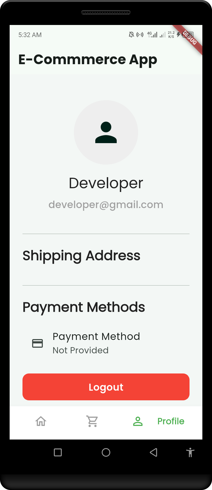

# 🛒 E-Commerce App (Flutter + Supabase)

A sleek and modern **E-Commerce mobile application** built with **Flutter** and **Supabase**.  
This app demonstrates professional UI/UX practices, seamless authentication, and a scalable backend — making it perfect for learning, showcasing, or extending into a real-world solution.

---

## ✨ Features
- 🔐 **Authentication** – Signup, Login, and Password reset with Supabase.  
- 🏠 **Home Screen** – Browse products with clean UI.  
- 📄 **Product Details** – Detailed product view with pricing.  
- 🛍️ **Cart System** – Add/remove items with smooth interactions.  
- 👤 **User Profile** – Manage your account.  
- 📱 **Cross-platform** – Runs on **Android & iOS**.

---

## 📸 Screenshots

| Login | Signup | Forgot Password |
|-------|--------|-----------------|
|  |  |  |

| Home | Detail | Cart | Profile |
|------|--------|------|---------|
|  |  |  |  |

---

## 🛠️ Tech Stack
- **Frontend:** Flutter, Dart  
- **Backend:** Supabase (Postgres + Auth)  
- **State Management:** Provider / Riverpod (based on your setup)  
- **Other:** Google Fonts, Material Design  

### Prerequisites
- [Flutter SDK](https://docs.flutter.dev/get-started/install) installed  
- A [Supabase](https://supabase.com) project with authentication enabled  

🤝 Contributing
Contributions are welcome! Feel free to fork this repo and submit a PR.

👨‍💻 Author
BrightFK
🚀 Passionate Flutter Developer | Supabase Enthusiast | Building scalable mobile apps

📫 Reach me on: GitHub

⭐ If you like this project, don’t forget to star the repo!

