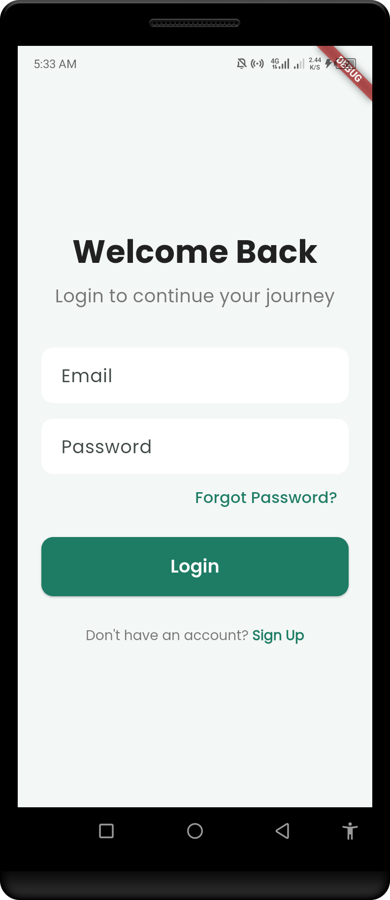
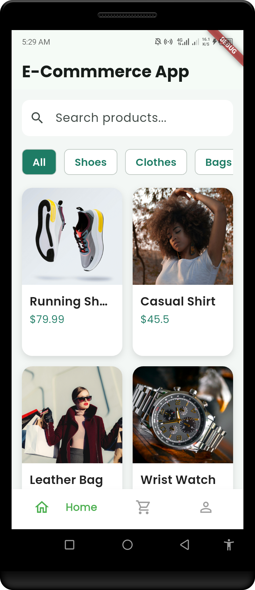
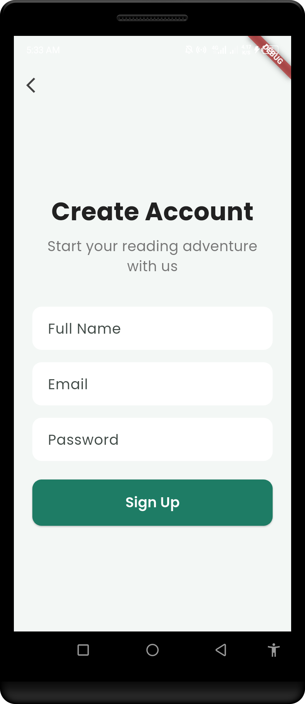
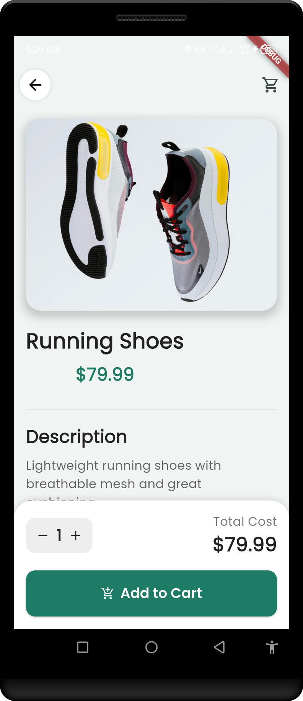
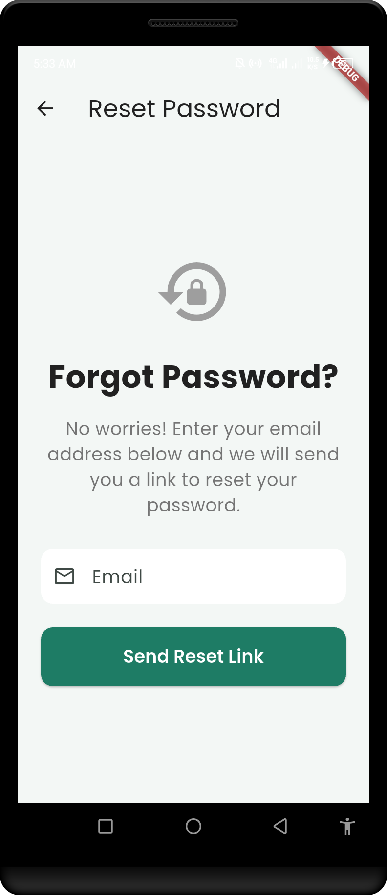
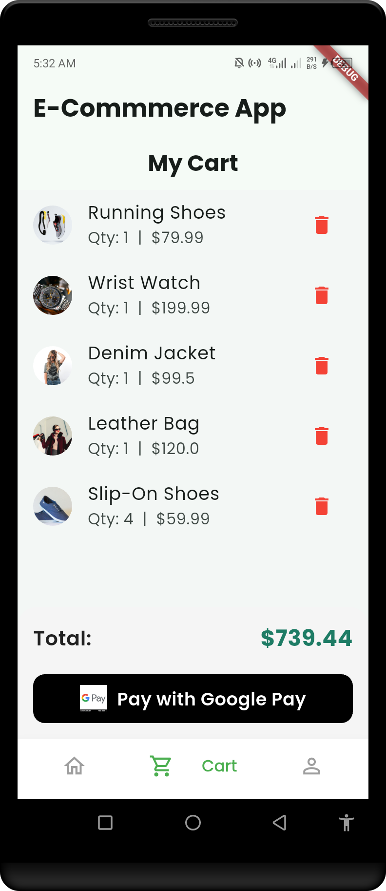

🛒 E-Commerce App (Flutter + Supabase)

<!-- Badges -->

A sleek and modern E-Commerce mobile application built with Flutter and Supabase. This app demonstrates professional UI/UX practices, seamless authentication, and a scalable backend—making it a perfect foundation for a real-world solution.
✨ Features
🔐 Full Authentication Flow: Sign up, Login, and Password Reset powered by Supabase Auth.
🏠 Dynamic Home Screen: Browse products with a clean, intuitive, and engaging UI.
📄 Product Details View: In-depth product descriptions, high-quality images, and pricing.
🛍️ Complete Cart System: Add, remove, and manage items in the cart with smooth interactions.
👤 User Profile Management: A dedicated section for users to manage their account details.
📱 Cross-Platform: A single codebase that runs beautifully on both Android & iOS.
📸 Screenshots
Here’s a sneak peek of the app's interface. For a better experience, check out the video demo!
Auth Flow	App Screens
	
	
	
🛠️ Tech Stack
Frontend: Flutter & Dart
Backend: Supabase (Postgres Database, Authentication)
State Management: Provider / Riverpod (clarify which one is used or if it's adaptable)
UI/UX: Material Design 3, Google Fonts
🚀 Getting Started
Follow these instructions to get the project up and running on your local machine.
Prerequisites
Flutter SDK installed (Installation Guide)
A free Supabase account and project.
Installation & Setup
Clone the Repository
code
Bash
git clone https://github.com/BrightFK/E-Commerce.git
cd E-Commerce
Install Dependencies
code
Bash
flutter pub get
Set up Supabase
Log in to your Supabase account and create a new project.
Navigate to Project Settings > API.
Find your Project URL and anon public Key.
Create a new file in the lib directory named constants.dart or similar.
Add your Supabase credentials to the file like this:
code
Dart
// lib/constants.dart
const String supabaseUrl = 'YOUR_SUPABASE_URL';
const String supabaseAnonKey = 'YOUR_SUPABASE_ANON_KEY';
Important: You will also need to set up your database tables (e.g., products, profiles). You can do this via the Supabase dashboard or by providing a SQL script in your repo.
Run the App
code
Bash
flutter run
The app should now be running on your connected device or emulator!
📂 Project Structure
The project follows a clean and scalable structure:
code
Code
lib/
 ┣ core/         # Core utilities, constants, and services
 ┣ models/       # Data models for products, users, etc.
 ┣ providers/    # State management logic
 ┣ screens/      # All application screens (UI)
 ┣ widgets/      # Reusable custom widgets
 ┗ main.dart     # The main entry point of the application
🤝 Contributing
Contributions, issues, and feature requests are welcome! Feel free to check the issues page.
Fork the Project
Create your Feature Branch (git checkout -b feature/AmazingFeature)
Commit your Changes (git commit -m 'Add some AmazingFeature')
Push to the Branch (git push origin feature/AmazingFeature)
Open a Pull Request
👨‍💻 Author
BrightFK
GitHub: @BrightFK
Passionate Flutter Developer & Supabase Enthusiast building scalable mobile apps.
⭐ If you like this project, don’t forget to give it a star! ⭐
